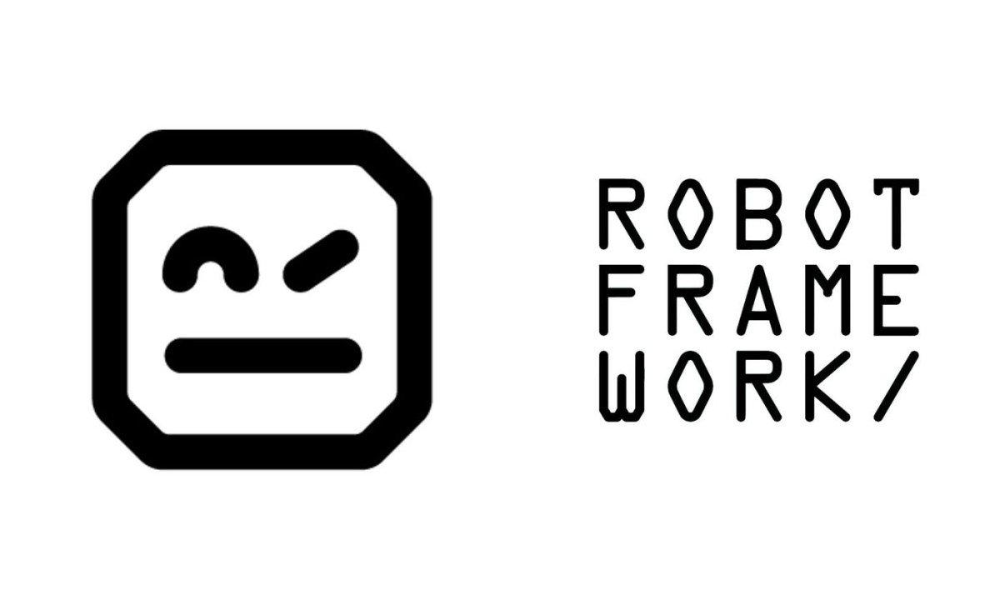
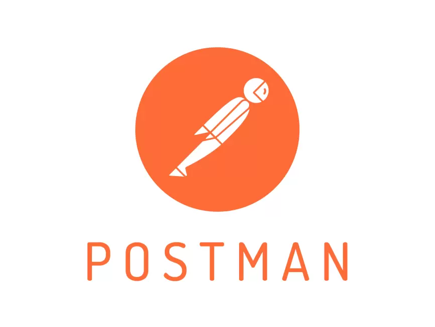
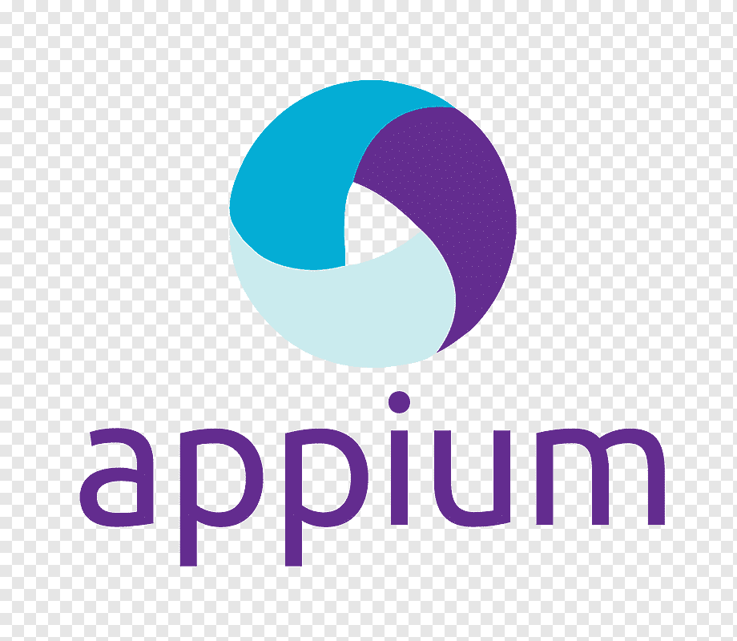
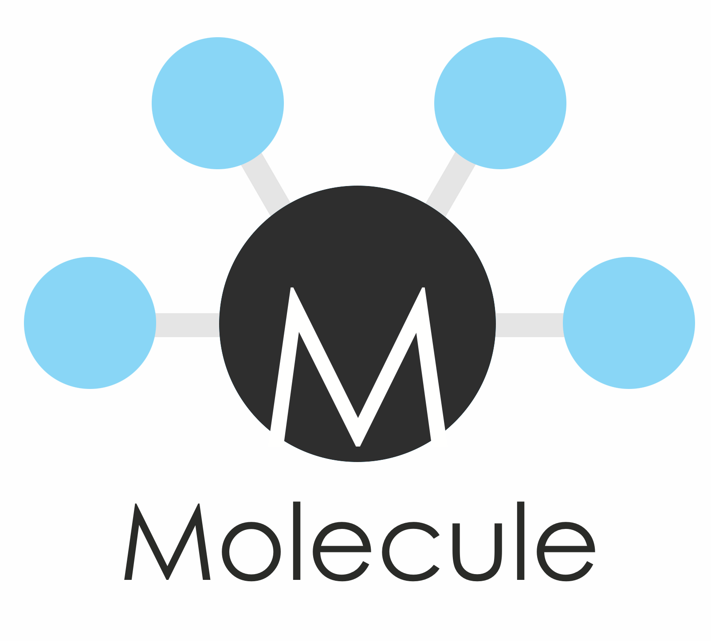
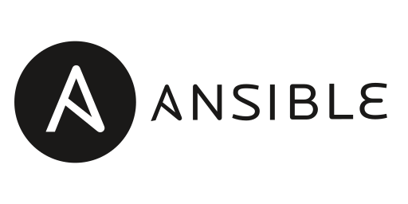
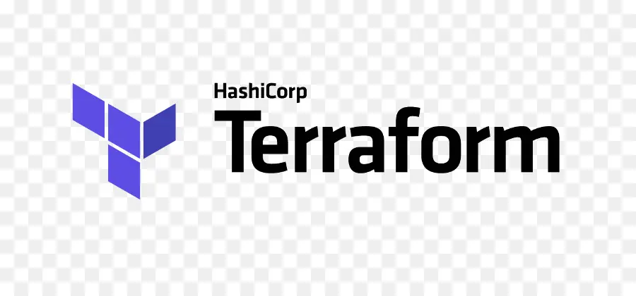
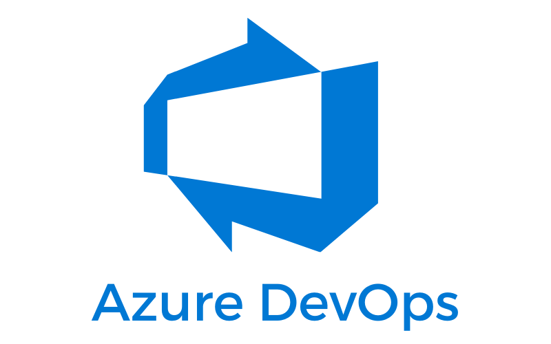

### Hello Everyone

I'm a Test Automation Architect/DevOps/Cloud Consultant with a strong background in Test Automation Frameworks, CI/CD, IAC, AI and Cloud Technologies.
#### Contacts
<table>
  <tr>
    <td>
      
    </td>
    <td>
      
    </td>
    <td>
      
    </td>
    <td>
      
    </td>
  </tr>
</table>

## Tools & Technologies

<table border="1">
    <tr>
        <th>web automation frameworks</th>
        <th>API Automation</th>
        <th>Mobile Automation</th>
        <th>Service Virtualization</th>
        <th>Performance Testing</th>
        <th>Security Testing</th>
        <th>IAC Testing</th>
        <th>DevOps</th>
        <th>Programming Languages</th>
    </tr>
    <tr>
        <td>
            <ul>
                <li></li>
                <li></li>
                <li></li>
                <li></li>
            </ul>
        </td>
        <td>
            <ul>
                <li></li>
                <li></li>
                <li></li>
            </ul>
        </td>
        <td>
            <ul>
                <li></li>
                <li></li>
            </ul>
        </td>
        <td>
            <ul>
                <li></li>
                <li></li>
                <li></li>
                <li></li>
            </ul>
        </td>
        <td>
            <ul>
                <li></li>
                <li></li>
                <li></li>
            </ul>
        </td>
        <td>
            <ul>
                <li></li>
                <li></li>
                <li></li>
                <li></li>
            </ul>
        </td>
        <td>
            <ul>
                <li></li>
                <li></li>
                <li></li>
                <li></li>
            </ul>
        </td>
        <td>
            <ul>
                <li></li>
                <li></li>
                <li></li>
                <li></li>
                <li></li>
                <li></li>
                <li></li>
                <li></li>
            </ul>
        </td>
        <td>
            <ul>
                <li></li>
                <li></li>
                <li></li>
                <li></li>
                <li></li>
            </ul>
        </td>
    </tr>
</table>

## GitHub Stats

