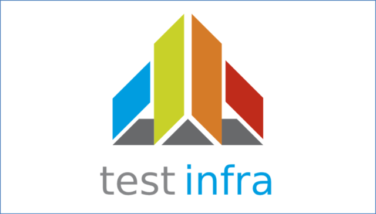
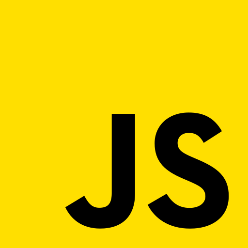

### Hello Everyone

I'm a Test Automation Architect/DevOps/Cloud Consultant with a strong background in Test Automation Frameworks, CI/CD, IAC, AI and Cloud Technologies.
#### Contacts
<table>
  <tr>
    <td>
      
    </td>
    <td>
      
    </td>
    <td>
      
    </td>
    <td>
      
    </td>
  </tr>
</table>

## Tools & Technologies

<table style="table-layout: fixed;" >
    <tr>
        <th style="width: 11.1%;">web automation frameworks</th>
        <th style="width: 11.1%;">API Automation</th>
        <th style="width: 11.1%;">Mobile Automation</th>
        <th style="width: 11.1%;">Service Virtualization</th>
        <th style="width: 11.1%;">Performance Testing</th>
        <th style="width: 11.1%;">Security Testing</th>
        <th style="width: 11.1%;">IAC Testing</th>
        <th style="width: 11.1%;">DevOps</th>
        <th style="width: 11.1%;">Programming Languages</th>
    </tr>
    <tr>
        <td>
            
            
            
            
        </td>
        <td>
            
            
            
        </td>
        <td>
            
        </td>
        <td>
            
            
            
        </td>
        <td>
            
            
            
            
        </td>
        <td>
            
            
            
            
        </td>
        <td>
            
            
        </td>
        <td>
            
            
            
            
            
            
            
            
        </td>
        <td>
            
            
            
            
            
        </td>
    </tr>
</table>

## GitHub Stats

